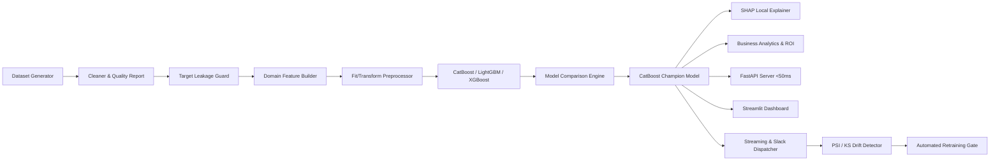

# Enterprise Customer Intelligence & Churn Prediction Platform

> Production-Grade Machine Learning Platform for B2B SaaS Customer Intelligence, Explainable Churn Prediction, Business Analytics, Real-Time Streaming Alerts & Automated Retraining.

---

## Key Platform Features

- 🎯 **Target Leakage Guard:** Strict automated isolation stripping post-churn temporal fields (`cancellation_processed_date`, `final_invoice_flag`, `account_status_deactivated`, `churn_reason_recorded`).
- ⚡ **Gradient Boosting Suite:** CatBoost (Champion, **0.9099 PR AUC**), LightGBM (**0.8888 PR AUC**), and XGBoost (**0.8710 PR AUC**) with early stopping.
- 💡 **SHAP Explainability Layer:** Per-customer SHAP attribution translated into plain-language business narratives.
- 💰 **Business ROI Engine:** Calculates Customer Lifetime Value (CLV), Revenue at Risk ($360K+), Retention ROI (304%), and generates prioritized high-risk customer call lists.
- 🚀 **Production FastAPI REST API:** `<50ms SLA` single prediction, batch prediction, `/explain`, Prometheus metrics, ReDoc & Swagger UI at `/docs`.
- 📊 **Streamlit Executive Dashboard:** Interactive multi-tab executive dashboard with real-time risk gauge calculator and campaign simulator.
- 📡 **Real-Time Streaming Engine:** High-velocity customer telemetry stream processor with sliding-window state tracking and Slack alert integration.
- 📉 **Drift Detection & Retraining:** Population Stability Index (PSI), Kolmogorov-Smirnov (KS) feature drift audits, Champion vs. Challenger promotion gate ($\ge 1.0\%$ relative PR AUC margin), and automated rollback.

---

## System Architecture



---

## QuickStart Guide

### 1. Installation
```bash
git clone https://github.com/rohitlavate97/enterprise-customer-intelligence-churn-prediction-platform-DS-3.git
cd enterprise-customer-intelligence-churn-prediction-platform-DS-3
pip install -r requirements.txt
```

### 2. Run Full Platform Workflow (1-Line Execution)
```bash
python -m scripts.run_full_pipeline
```

### 3. Launch FastAPI Production Inference Server
```bash
uvicorn api.app:app --host 0.0.0.0 --port 8000 --reload
```
- **Swagger UI Documentation:** `http://localhost:8000/docs`
- **ReDoc Documentation:** `http://localhost:8000/redoc`
- **Platform Version Info:** `http://localhost:8000/version`
- **Prometheus Metrics:** `http://localhost:8000/metrics`
- **OpenAPI JSON:** `http://localhost:8000/openapi.json`

### 4. Launch Executive Streamlit Dashboard
```bash
streamlit run dashboard/app.py
```

---

## Complete CLI Script Reference Guide

| Command Script | Description |
| :--- | :--- |
| `python -m scripts.generate_data` | Generates 100,000 synthetic customer records with ground-truth signals. |
| `python -m scripts.run_pipeline` | Executes cleaning, deduplication, quality profiling, and Target Leakage Guard. |
| `python -m scripts.train_baselines` | Trains 8 baseline models across 5-fold Stratified K-Fold CV. |
| `python -m scripts.train_xgboost` | Trains XGBoost classifier with early stopping & SHAP explanations. |
| `python -m scripts.train_lightgbm` | Trains LightGBM classifier with leaf-wise histogram growth. |
| `python -m scripts.train_catboost` | Trains CatBoost classifier with ordered target encoding & triple benchmark. |
| `python -m scripts.run_comparison` | Compares all models, selects Champion, and exports markdown report. |
| `python -m scripts.run_explainability` | Generates SHAP local traces and segment fairness audit. |
| `python -m scripts.run_business_analytics` | Calculates CLV, revenue at risk, campaign ROI, and call list CSV. |
| `python -m scripts.run_drift_monitoring` | Audits PSI & KS distribution shifts across serving data windows. |
| `python -m scripts.run_retraining_pipeline` | Retrains candidate, tests Champion vs Challenger gate, and handles rollback. |
| `python -m scripts.run_full_pipeline` | Master orchestrator executing all 17 platform stages sequentially. |

---

## Test Suite Execution
```bash
python -m pytest
```
*70+ unit & integration tests passing cleanly across all 20 phases.*
