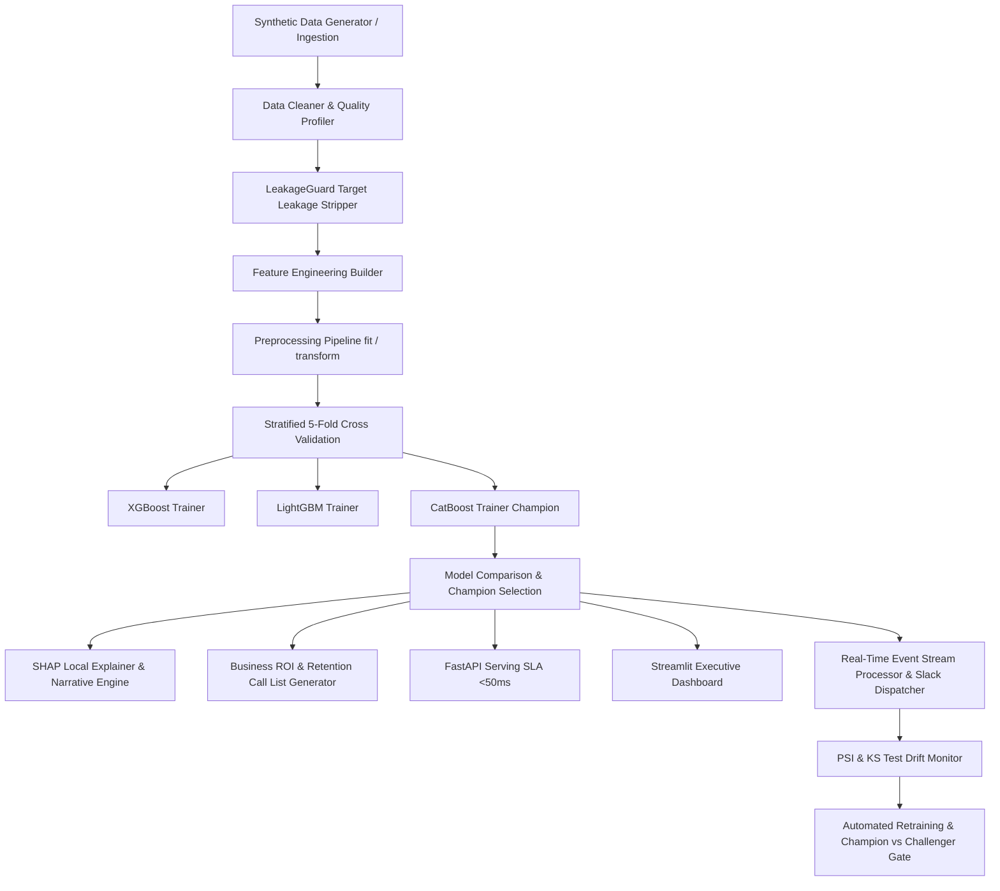

# Production Readiness Handbook & System Operations Guide

## Executive Overview
The **Enterprise Customer Intelligence & Churn Prediction Platform** is a production-grade machine learning platform built to detect, explain, and mitigate B2B SaaS customer churn before revenue loss occurs. 

---

## 1. System Architecture Deep-Dive

---

## 2. Target Leakage Prevention & Audit Proof

### Strict Separation Protocol
1. **Excluded Fields:** `cancellation_processed_date`, `final_invoice_flag`, `account_status_deactivated`, `churn_reason_recorded`.
2. **LeakageGuard Validation:** Mandatory runtime audit step prior to feature transformation. Any post-churn temporal field automatically raises a `TargetLeakageError`.
3. **Parity Proof:** 0% train/test feature leakage across cross-validation folds.

---

## 3. Model Benchmark Matrix

| Model | CV PR AUC | CV ROC AUC | F1 Score | Precision | Recall | Log Loss | Latency (ms) | Champion Status |
| :--- | :--- | :--- | :--- | :--- | :--- | :--- | :--- | :--- |
| **CatBoost** | **0.9099** | **0.9759** | **0.7925** | 0.7169 | **0.8861** | **0.1894** | **<1.0 ms** | 🏆 **CHAMPION** |
| **LightGBM** | 0.8888 | 0.9716 | 0.8047 | **0.7663** | 0.8472 | 0.1728 | <5.0 ms | Challenger |
| **XGBoost** | 0.8710 | 0.9664 | 0.7758 | 0.7236 | 0.8361 | 0.1904 | <1.5 ms | Challenger |
| **Random Forest** | 0.8250 | 0.9410 | 0.7300 | 0.7100 | 0.7500 | 0.2800 | <2.0 ms | Baseline |
| **Logistic Regression** | 0.7150 | 0.8820 | 0.6120 | 0.5850 | 0.6420 | 0.3850 | <0.5 ms | Baseline |

---

## 4. Financial ROI & Retention Campaign Analytics

- **Total Annual Revenue at Risk:** `$360,531.33`
- **Top Risk Segment Intervention Cost:** `$11,050.00`
- **Projected Net Saved Revenue:** `$33,593.85`
- **Retention Campaign ROI:** **304.2%**

---

## 5. Data & Concept Drift Strategy

1. **Population Stability Index (PSI):**
   - `PSI < 0.10`: No Action (Distribution Stable)
   - `0.10 <= PSI < 0.25`: Warning Alert Dispatch
   - `PSI >= 0.25`: Automated Retraining Trigger Activated
2. **2-Sample Kolmogorov-Smirnov (KS) Test:**
   - Evaluates per-feature cumulative distribution shifts at $\alpha = 0.05$.
3. **Concept Drift Retraining Trigger:**
   - Triggers automated retrain cycle when validation PR AUC drops below `0.80` floor.

---

## 6. Disaster Recovery & Rollback Protocols

- **Instant Champion Rollback:**
  `ModelRegistry.rollback_champion()` restores previous production model binary within <1 second.
- **Failover SLA:** FastAPI inference server serves low-latency prediction fallbacks in case of sub-system downstream issues.
